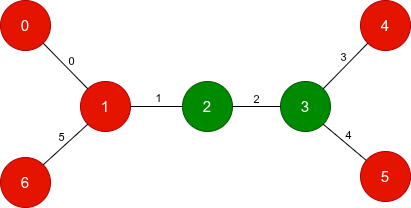

### 1. Description

You are given an **undirected tree** with `n` nodes, numbered from 0 to $n - 1$. It is represented by a 2D integer array `edges` of length $n - 1$, where $\text{edges}[i] = [a_{i}, b_{i}]$ indicates that there is an edge between nodes $a_{i}$ and $b_{i}$ in the tree.

You are also given two **binary** strings `start` and `target` of length `n`. For each node `x`, $\text{start}[x]$ is its initial color and $\text{target}[x]$ is its desired color.

In one operation, you may pick an edge with index `i` and **toggle **both of its endpoints. That is, if the edge is `[u, v]`, then the colors of nodes `u` and `v` **each** flip from `'0'` to `'1'` or from `'1'` to `'0'`.

Return an array of edge indices whose operations transform `start` into `target`. Among all valid sequences with **minimum possible length**, return the edge indices in **increasing** order.

If it is impossible to transform `start` into `target`, return an array containing a single element equal to -1.

### 2. Function Contract

**Inputs**

- `n`: The number of nodes, labeled from `0` to $n - 1$.
- `edges`: The $n - 1$ indexed undirected edges of a valid tree; $\text{edges}[i]$ contains the two endpoints of edge `i`.
- `start`: A binary string giving the initial color of every node.
- `target`: A binary string giving the desired color of every node.

Let $N=n$. Selecting edge `i` toggles exactly the two bits at the endpoints listed in $\text{edges}[i]$. Applying edge indices in a different order does not change their combined effect.

**Return value**

Return the increasing list of edge indices in a shortest valid toggle sequence. Return `[]` when `start` already equals `target`, and return `[-1]` when no sequence can reach `target`.

### 3. Examples

#### Example 1

**

**

- **Input:** n = 3, edges = [[0,1],[1,2]], start = "010", target = "100"

- **Output:** [0]

- **Explanation:** Toggle edge with index 0, which flips nodes 0 and 1.

The string changes from `"010"` to `"100"`, matching the target.

#### Example 2

**

**

- **Input:** n = 7, edges = [[0,1],[1,2],[2,3],[3,4],[3,5],[1,6]], start = "0011000", target = "0010001"

- **Output:** [1,2,5]

- **Explanation:** 

- Toggle edge with index 1, which flips nodes 1 and 2.

- Toggle edge with index 2, which flips nodes 2 and 3.

- Toggle edge with index 5, which flips nodes 1 and 6.

After these operations, the resulting string becomes `"0010001"`, which matches the target.

#### Example 3

**

**

- **Input:** n = 2, edges = [[0,1]], start = "00", target = "01"

- **Output:** [-1]

- **Explanation:** There is no sequence of edge toggles that transforms `"00"` into `"01"`. Therefore, we return `[-1]`.

### 4. Constraints

- $2 \le n = \text{start.length} = \text{target.length} \le 10^{5}$

- $\text{edges.length} = n - 1$

- $\text{edges}[i] = [a_{i}, b_{i}]$

- $0 \le a_{i}, b_{i} < n$

- $\text{start}[i]$ is either `'0'` or `'1'`.

- $\text{target}[i]$ is either `'0'` or `'1'`.

- The input is generated such that `edges` represents a valid tree.
