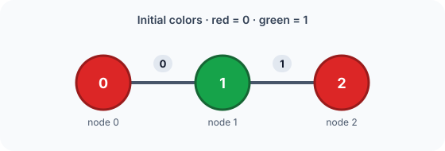
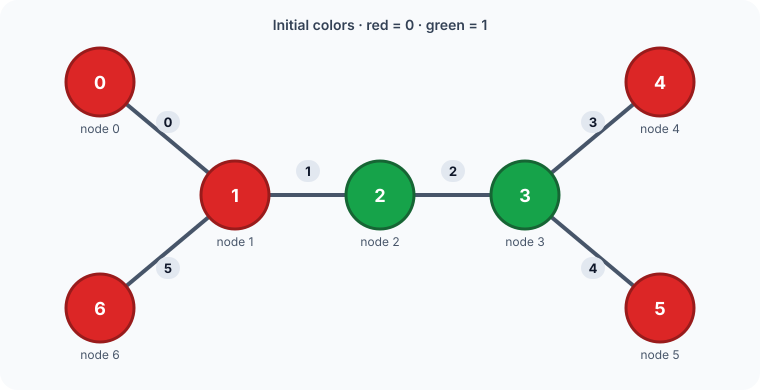
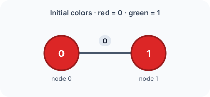

## Examples

**Example 1**

- Input: `n = 3, edges = [[0,1],[1,2]], start = "010", target = "100"`
- Output: `[0]`
- Explanation:
  - Toggle edge `0`, which flips nodes `0` and `1`.
  - The color string changes from `"010"` to `"100"`, exactly matching `target`.

**Example 2**

- Input: `n = 7, edges = [[0,1],[1,2],[2,3],[3,4],[3,5],[1,6]], start = "0011000", target = "0010001"`
- Output: `[1,2,5]`
- Explanation:
  - Toggle edge `1`, flipping nodes `1` and `2`.
  - Toggle edge `2`, flipping nodes `2` and `3`.
  - Toggle edge `5`, flipping nodes `1` and `6`.
  - After these operations, the color string is `"0010001"`, which equals `target`.

**Example 3**

- Input: `n = 2, edges = [[0,1]], start = "00", target = "01"`
- Output: `[-1]`
- Explanation:
  - Every operation toggles both endpoints of the only edge, so no sequence can change `"00"` into `"01"`.
  - The required result is therefore `[-1]`.
