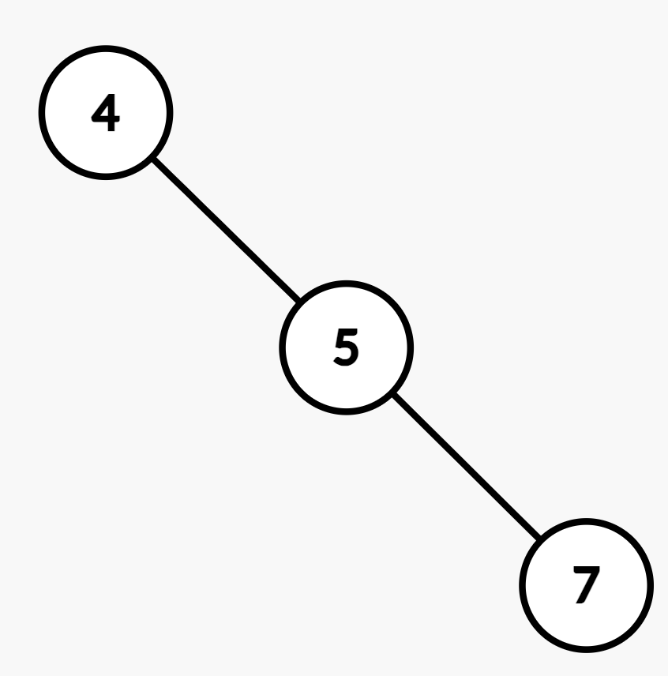
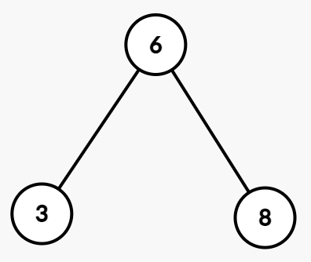
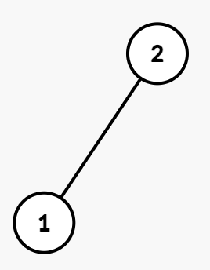

## Description

You are given the `root` of a **Binary Search Tree (BST)** and an integer `level`.

The root node is at level 0. Each level represents the distance from the root.

Return the **median value** of all node values present at the given `level`. If the level does not exist or contains no nodes, return -1.

The **median** is defined as the middle element after sorting the values at that level in **non-decreasing** order. If the number of values at that level is even, return the **upper** median (the larger of the two middle elements after sorting).
### Function Contract

**Inputs**

- `root`: The root node of a nonempty Binary Search Tree.
- `level`: The zero-based distance from the root whose node values are queried.

Let $N$ be the number of nodes in the tree, $K$ the number of nodes at the requested level, and $W$ the tree's maximum width.

The tree obeys the BST ordering property. Values at the requested level are interpreted in non-decreasing order when selecting their median. For $K>0$, the upper median has zero-based sorted index $\lfloor K/2\rfloor$.

**Return value**

Return the requested level's median value, using the upper median when $K$ is even. Return `-1` when $K=0$.

### Examples

#### Example 1

**Input:** root = [4,null,5,null,7], level = 2

**Output:** 7

**Explanation:**

The nodes at $level = 2$ are `[7]`. The median value is 7.

#### Example 2

**Input:** root = [6,3,8], level = 1

**Output:** 8

**Explanation:**

The nodes at $level = 1$ are `[3, 8]`. There are two possible median values, so the larger one 8 is the answer.

#### Example 3

**​​​​​​​​​​​​​​**

**Input:** root = [2,1], level = 2

**Output:** -1

**Explanation:**

There is no node present at $level = 2$​​​​​​​, so the answer is -1.

### Constraints

- The number of nodes in the tree is in the range $[1, 2 * 10^{5}]$.

- $1 \le \text{Node.val} \le 10^{6}$

- $0 \le level \le 2 * 10^​​​​​​​5$