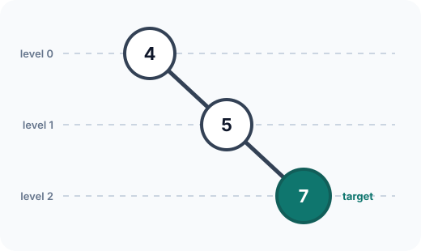
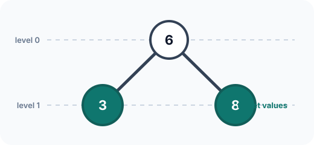
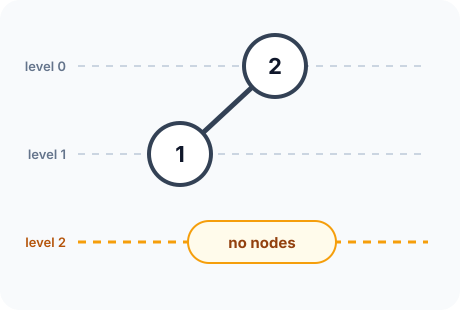

## Examples

**Example 1**

- Input: `root = [4,null,5,null,7], level = 2`
- Output: `7`
- Explanation: Level `2` contains only `[7]`, whose sole value is its median.

**Example 2**

- Input: `root = [6,3,8], level = 1`
- Output: `8`
- Explanation: The values at level `1` are `[3,8]`. With two middle candidates, the upper median is the larger one, `8`.

**Example 3**

- Input: `root = [2,1], level = 2`
- Output: `-1`
- Explanation: The tree has no node at level `2`, so the required result is `-1`.
