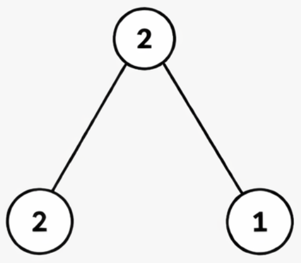
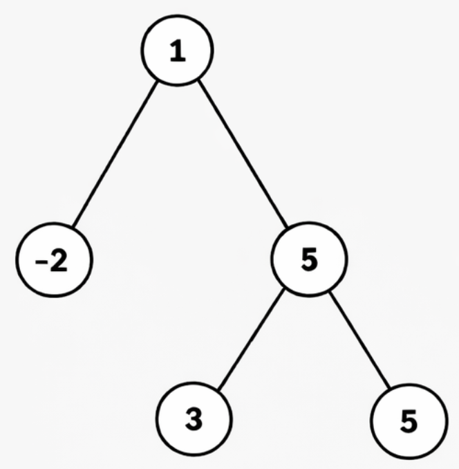
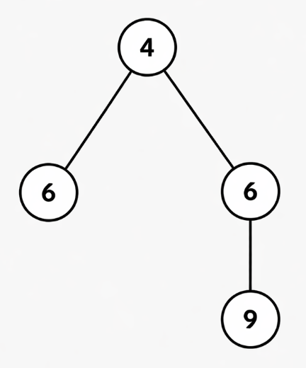

### 1. Description

You are given the `root` of a **binary tree**, where each node contains an integer value.

A **valid path** in the tree is a sequence of **connected** nodes such that:

- The path can start and end at **any node** in the tree.

- The path does **not** need to pass through the root.

- All node values along the path are **distinct**.

Return an integer denoting the **maximum** possible sum of node values among all valid paths.

### 2. Function Contract

**Inputs**

- `root`: The binary tree. App-authored cases serialize it in level order, using `null` for a missing child; the local judge deserializes that form into a node tree, matching the `TreeNode` root supplied to the native method.

Let $n$ be the number of non-null nodes. A path follows tree edges and may move through a parent between two branches. Each selected node contributes its value once, and no two selected nodes may have equal values.

**Return value**

Return the maximum sum over every non-empty connected path whose node values are pairwise distinct. A one-node path is valid, so the result remains well-defined when every value is negative.

### 3. Examples

#### Example 1

**Input:** root = [2,2,1]

**Output:** 3

**Explanation:**

- The path `2 → 2` is invalid because the value 2 is not distinct.

- The maximum-sum valid path is `2 → 1`, with a sum = $2 + 1 = 3$.

#### Example 2

**Input:** root = [1,-2,5,null,null,3,5]

**Output:** 9

**Explanation:**

- The path `3 → 5 → 5` is invalid due to duplicate value 5.

- The maximum-sum valid path is `1 → 5 → 3`, with a sum = $1 + 5 + 3 = 9$.

#### Example 3

​​​​​​​

**Input:** root = [4,6,6,null,null,null,9]

**Output:** 19

**Explanation:**

- The path `6 → 4 → 6 → 9` is invalid because the value 6 appears more than once.

- The maximum-sum valid path is `4 → 6 → 9`, with a sum = $4 + 6 + 9 = 19$.

### 4. Constraints

- The number of nodes in the tree is in the range `[1, 1000]`.

- $-1000 \le \text{Node.val} \le 1000​​​​​​​$