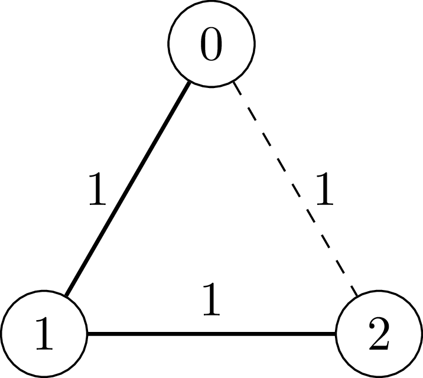
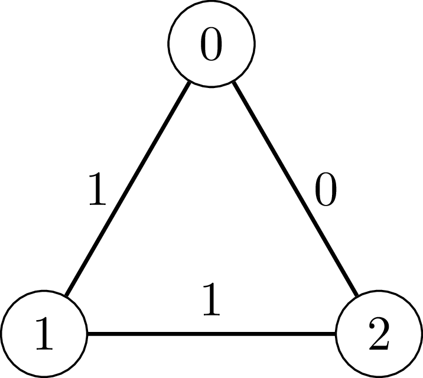

### 1. Description

You are given a positive integer `n`.

There is an **undirected** graph with `n` nodes labeled from 0 to $n - 1$. Initially, the graph has no edges.

You are also given a 2D integer array `edges`, where $\text{edges}[i] = [u_{i}, v_{i}, w_{i}]$ represents an edge between nodes $u_{i}$ and $v_{i}$ with weight $w_{i}$. The weight $w_{i}$ is either 0 or 1.

Process the edges in `edges` in the given order. For each edge, add it to the graph only if, after adding it, the sum of the weights of the edges in **every** cycle in the resulting graph is **even**.

Return an integer denoting the number of edges that are successfully added to the graph.

### 2. Function Contract

**Inputs**

- `n`: The number of vertices, labelled from `0` through $n - 1$.
- `edges`: The ordered edge proposals, each written as `[u, v, w]` for endpoints `u < v` and binary weight `w`.

Let $N=n$ and $M=\lvert\texttt{edges}\rvert$. The graph is undirected, begins empty, and changes only when the current proposal preserves even total weight in every cycle.

**Return value**

Return the number of accepted edges after all $M$ proposals have been processed in order.

### 3. Examples

#### Example 1

- **Input:** n = 3, edges = [[0,1,1],[1,2,1],[0,2,1]]

- **Output:** 2

- **Explanation:** 

- `[0, 1, 1]`: We add the edge between vertex 0 and vertex 1 with weight 1.

- `[1, 2, 1]`: We add the edge between vertex 1 and vertex 2 with weight 1.

- `[0, 2, 1]`: The edge between vertex 0 and vertex 2 (the dashed edge in the diagram) is not added because the cycle $0 - 1 - 2 - 0$ has total edge weight $1 + 1 + 1 = 3$, which is an odd number.

#### Example 2

- **Input:** n = 3, edges = [[0,1,1],[1,2,1],[0,2,0]]

- **Output:** 3

- **Explanation:** 

- `[0, 1, 1]`: We add the edge between vertex 0 and vertex 1 with weight 1.

- `[1, 2, 1]`: We add the edge between vertex 1 and vertex 2 with weight 1.

- `[0, 2, 0]`: We add the edge between vertex 0 and vertex 2 with weight 0.

- Note that the cycle $0 - 1 - 2 - 0$ has total edge weight $1 + 1 + 0 = 2$, which is an even number.

### 4. Constraints

- $3 \le n \le 5 * 10^{4}$

- $1 \le \text{edges.length} \le 5 * 10^{4}$

- $\text{edges}[i] = [u_{i}, v_{i}, w_{i}]$

- $0 \le u_{i} < v_{i} < n$

- All edges are distinct.

- $w_{i} = 0 or w_{i} = 1$
