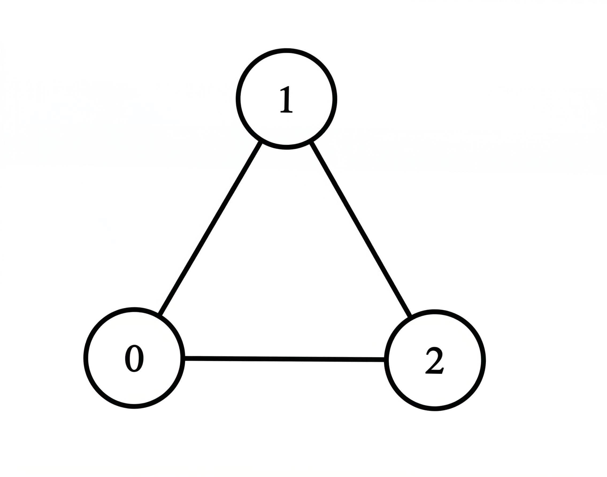
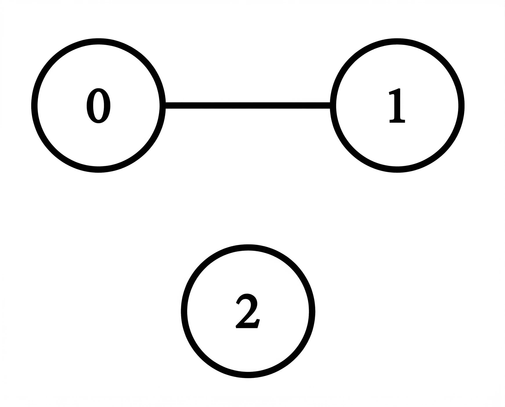

### 1. Description

You are given a 2D integer array `matrix` of size `n x n` representing the adjacency matrix of an undirected graph with `n` vertices labeled from 0 to $n - 1$.

- $\text{matrix}[i][j] = 1$ indicates that there is an edge between vertices `i` and `j`.

- $\text{matrix}[i][j] = 0$ indicates that there is no edge between vertices `i` and `j`.

The **degree** of a vertex is the number of edges connected to it.

Return an integer array `ans` of size `n` where $\text{ans}[i]$ represents the degree of vertex `i`.

### 2. Function Contract

**Inputs**

- `matrix`: A square, symmetric binary adjacency matrix for a simple undirected graph.

Let $N=\texttt{matrix.length}$. Vertex labels and both matrix indices range from $0$ through $N-1$. A zero diagonal means the graph has no self-loops.

**Return value**

Return an array of length $N$ whose entry at index $i$ is the number of edges connected to vertex $i$.

### 3. Examples

#### Example 1

- **Input:** matrix = [[0,1,1],[1,0,1],[1,1,0]]

- **Output:** [2,2,2]

- **Explanation:** 

- Vertex 0 is connected to vertices 1 and 2, so its degree is 2.

- Vertex 1 is connected to vertices 0 and 2, so its degree is 2.

- Vertex 2 is connected to vertices 0 and 1, so its degree is 2.

Thus, the answer is `[2, 2, 2]`.

#### Example 2

- **Input:** matrix = [[0,1,0],[1,0,0],[0,0,0]]

- **Output:** [1,1,0]

- **Explanation:** 

- Vertex 0 is connected to vertex 1, so its degree is 1.

- Vertex 1 is connected to vertex 0, so its degree is 1.

- Vertex 2 is not connected to any vertex, so its degree is 0.

Thus, the answer is `[1, 1, 0]`.

#### Example 3

- **Input:** matrix = [[0]]

- **Output:** [0]

- **Explanation:** There is only one vertex and it has no edges connected to it. Thus, the answer is `[0]`.

### 4. Constraints

- $1 \le n = \text{matrix.length} = \text{matrix}[i].length \le 100$

- $\text{matrix}[i][i] = 0$

- $\text{matrix}[i][j]$ is either 0 or 1

- $\text{matrix}[i][j] = \text{matrix}[j][i]$
