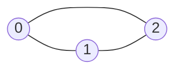
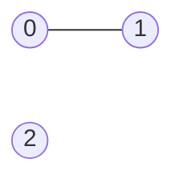

## Examples

**Example 1**

- Input: `matrix = [[0,1,1],[1,0,1],[1,1,0]]`
- Output: `[2,2,2]`
- Explanation:
  - Vertex $0$ is adjacent to vertices $1$ and $2$, giving degree $2$.
  - Vertex $1$ is adjacent to vertices $0$ and $2$, giving degree $2$.
  - Vertex $2$ is adjacent to vertices $0$ and $1$, giving degree $2$.

  Therefore the degree array is `[2,2,2]`.

**Example 2**

- Input: `matrix = [[0,1,0],[1,0,0],[0,0,0]]`
- Output: `[1,1,0]`
- Explanation:
  - Vertex $0$ has the single neighbor $1$, so its degree is $1$.
  - Vertex $1$ has the single neighbor $0$, so its degree is $1$.
  - Vertex $2$ is isolated and has degree $0$.

  Therefore the degree array is `[1,1,0]`.

**Example 3**

- Input: `matrix = [[0]]`
- Output: `[0]`
- Explanation: The graph contains one vertex and no edges, so that vertex has degree $0$.
