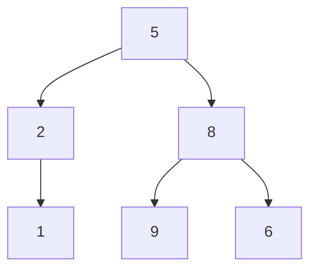
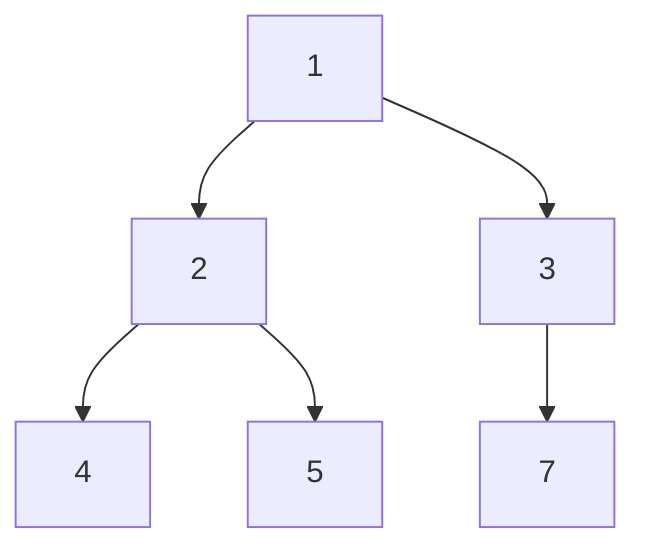

## Examples

**Example 1**

- Input: `root = [5,2,8,1,null,9,6]`
- Output: `[5,8,0]`
- Explanation:

  - Level $1$ is inspected left to right. Node `5` has a left child, so its value is included and `ans[0] = 5`.
  - Level $2$ is inspected right to left. Node `8` has a right child and contributes `8`; node `2` has no right child, so the level stops with `ans[1] = 8`.
  - Level $3$ is inspected left to right. Its first node, `1`, has no left child, so no value is included and `ans[2] = 0`.
  - The resulting array is `[5, 8, 0]`.

**Example 2**

- Input: `root = [1,2,3,4,5,null,7]`
- Output: `[1,5,0]`
- Explanation:

  - On level $1$, node `1` has a left child and is included, giving `ans[0] = 1`.
  - On level $2$, inspect `3` before `2`. Both nodes have right children, so both values contribute and `ans[1] = 3 + 2 = 5`.
  - On level $3$, node `4` is encountered first and has no left child. The sum therefore remains `0`, so `ans[2] = 0`.
  - Thus the returned array is `[1, 5, 0]`.
