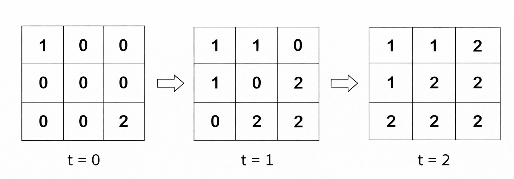
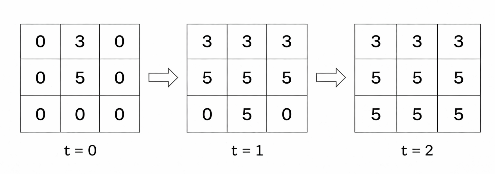
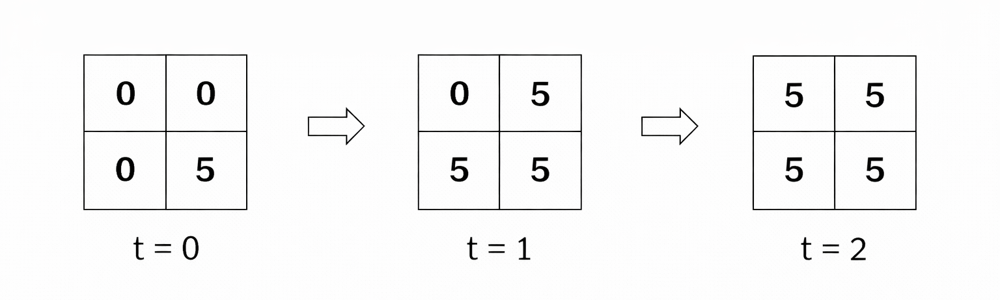

## Description

You are given two integers `n` and `m` representing the number of rows and columns of a grid, respectively.

You are also given a 2D integer array `sources`, where $\text{sources}[i] = [r_{i}, c_{i}, color_​​​​​​​i]$ indicates that the cell $(r_{i}, c_{i})$ is initially colored with $\text{color}_{i}$. All other cells are initially uncolored and represented as 0.

At each time step, every currently colored cell spreads its color to all adjacent **uncolored** cells in the four directions: up, down, left, and right. All spreads happen simultaneously.

If **multiple** colors reach the same uncolored cell at the same time step, the cell takes the color with the **maximum** value.

The process continues until no more cells can be colored.

Return a 2D integer array representing the final state of the grid, where each cell contains its final color.
### Function Contract

**Inputs**

- `n`: The number of grid rows.
- `m`: The number of grid columns.
- `sources`: A non-empty array of distinct source coordinates and their initial positive colors, with each entry formatted as `[row, column, color]`.

Rows are indexed from `0` through `n - 1`, and columns from `0` through `m - 1`. Adjacency is orthogonal; diagonally touching cells do not spread directly to one another. Every time step uses the grid state from the beginning of that step, so competing arrivals are resolved together rather than by iteration order.

**Return value**

Return an $n$-by-$m$ integer matrix containing the final color of every cell after the simultaneous four-directional spreading process stops.

### Examples
#### Example 1

**Input:** n = 3, m = 3, sources = [[0,0,1],[2,2,2]]

**Output:** [[1,1,2],[1,2,2],[2,2,2]]

**Explanation:**

The grid at each time step is as follows:

​​​​​​​

At time step 2, cells `(0, 2)`, `(1, 1)`, and `(2, 0)` are reached by both colors, so they are assigned color 2 as it has the maximum value among them.

#### Example 2

**Input:** n = 3, m = 3, sources = [[0,1,3],[1,1,5]]

**Output:** [[3,3,3],[5,5,5],[5,5,5]]

**Explanation:**

The grid at each time step is as follows:

#### Example 3

**Input:** n = 2, m = 2, sources = [[1,1,5]]

**Output:** [[5,5],[5,5]]

**Explanation:**

The grid at each time step is as follows:

​​​​​​​

Since there is only one source, all cells are assigned the same color.

### Constraints

- $1 \le n, m \le 10^{5}$

- $1 \le n * m \le 10^{5}$

- $1 \le \text{sources.length} \le n * m$

- $\text{sources}[i] = [r_{i}, c_{i}, \text{color}_{i}]$

- $0 \le r_{i} \le n - 1$

- $0 \le c_{i} \le m - 1$

- $1 \le \text{color}_{i} \le 10^{6}​​​​​​​$

- All $(r_{i}, c_{i}​​​​​​​)$ in `sources` are distinct.