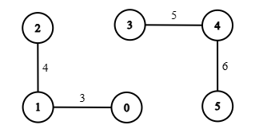
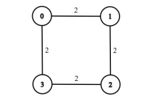

### 1. Description

There is an undirected weighted graph with `n` nodes labeled from 0 to $n - 1$.

The graph is represented by a 2D integer array `edges`, where each edge $\text{edges}[i] = [u_{i}, v_{i}, w_i]$ indicates that there is an undirected edge between nodes $u_{i}$ and $v_{i}$ with weight `w_i`.

You are also given integers `source`, `target` and `k`.

A `threshold` value determines whether an edge is considered **light** or **heavy**:

- An edge is **light** if its weight is **less than** or **equal** to `threshold`.

- An edge is **heavy** if its weight is **greater than** `threshold`.

A path from `source` to `target` is **valid** if it contains **at most** `k` heavy edges.

Return the **minimum integer **`threshold` such that **at least** one **valid** path exists from `source` to `target`. If no such path exists, return -1.

### 2. Function Contract

**Inputs**

- `n`: The number of nodes, labelled from `0` to $n - 1$.
- `edges`: The undirected weighted edges. Each entry `[u, v, w]` joins `u` and `v` with weight `w`.
- `source`: The starting node.
- `target`: The destination node.
- `k`: The greatest number of heavy edges that a valid path may traverse.

Let $m$ be `edges.length`. For a chosen integer threshold $T$, an edge of weight $w$ is light exactly when $w \le T$; otherwise it is heavy.

**Return value**

Return the minimum integer $T$ for which some `source`-to-`target` path contains at most `k` heavy edges. Return `-1` if no such path exists. When $source = target$, the empty path is valid and the minimum threshold is `0`.

### 3. Examples

#### Example 1

- **Input:** n = 6, edges = [[0,1,5],[1,2,3],[3,4,4],[4,5,1],[1,4,2]], source = 0, target = 3, k = 1

- **Output:** 4

- **Explanation:** The minimum `threshold` such that a path from node 0 to node 3 uses at most 1 heavy edge is 4.

- Light edges: `[1, 2, 3]`, `[3, 4, 4]`, `[4, 5, 1]`, `[1, 4, 2]`

- Heavy edges: `[0, 1, 5]`

A valid path is `0 → 1 → 4 → 3`. It uses only 1 heavy edge (`[0, 1, 5]`), which satisfies the limit $k = 1$.

Any smaller `threshold` would make it impossible to reach node 3 without exceeding 1 heavy edge.

#### Example 2

- **Input:** n = 6, edges = [[0,1,3],[1,2,4],[3,4,5],[4,5,6]], source = 0, target = 4, k = 1

- **Output:** -1

- **Explanation:** There is no path from node 0 to node 4. Since the target cannot be reached, the output is -1.

#### Example 3

**

**

- **Input:** n = 4, edges = [[0,1,2],[1,2,2],[2,3,2],[3,0,2]], source = 0, target = 0, k = 0

- **Output:** 0

- **Explanation:** The source and target are the same node. No edges need to be traversed, so the minimum `threshold` is 0.

### 4. Constraints

- $1 \le n \le 10^{3}$

- $0 \le \text{edges.length} \le 10^{3}$

- $\text{edges}[i] = [u_{i}, v_{i}, w_{i}]$

- $0 \le u_{i}, v_{i} \le n - 1$

- $1 \le w_{i} \le 10^{9}$

- $0 \le source, target \le n - 1$

- $0 \le k \le \text{edges.length}$
