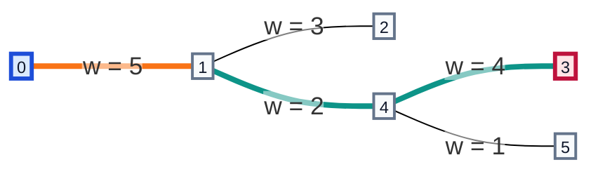
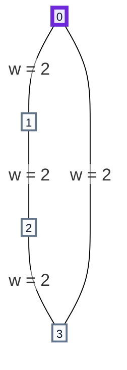

## Examples

**Example 1**

- Input: `n = 6, edges = [[0,1,5],[1,2,3],[3,4,4],[4,5,1],[1,4,2]], source = 0, target = 3, k = 1`
- Output: `4`
- Explanation: At threshold $4$, exactly one heavy edge is needed on the displayed route.

The graph and the feasible route can be represented independently as:

At threshold $4$, the edges of weights $3$, $4$, $1$, and $2$ are light. The path `0 -> 1 -> 4 -> 3` uses only the weight-$5$ edge as heavy, so it respects `k = 1`. Every smaller threshold forces any route from `0` to `3` to use more than one heavy edge, making $4$ minimal.

**Example 2**

- Input: `n = 6, edges = [[0,1,3],[1,2,4],[3,4,5],[4,5,6]], source = 0, target = 4, k = 1`
- Output: `-1`
- Explanation: The endpoints belong to different connected components.

The graph has two disconnected components:

```mermaid
---
config:
  theme: base
  htmlLabels: false
  themeVariables:
    background: "#ffffff"
    textColor: "#0f172a"
    edgeLabelBackground: "#ffffff"
  themeCSS: ".node .label text,.node .label tspan{font-size:12px!important}.edgeLabel rect,.edgeLabel .background{fill:#fff!important;stroke:#475569!important;stroke-width:1.5px!important;opacity:1!important;rx:3px;ry:3px}.edgeLabel text,.edgeLabel tspan{font-size:18px!important;font-weight:700!important;fill:#0f172a!important;stroke:#fff!important;stroke-width:4px!important;paint-order:stroke fill!important;stroke-linejoin:round!important}"
  flowchart:
    padding: 2
    nodeSpacing: 40
    rankSpacing: 72
---
flowchart TB
    accTitle: Example 2 disconnected weighted graph
    accDescr: The source component is the path 0-1-2 with edge weights 3 and 4. The target component is the separate path 3-4-5 with edge weights 5 and 6.

    subgraph sourceComponent[Source component]
        direction LR
        n0["0"] ---|w = 3| n1["1"] ---|w = 4| n2["2"]
    end
    subgraph targetComponent[Target component]
        direction LR
        n3["3"] ---|w = 5| n4["4"] ---|w = 6| n5["5"]
    end

    classDef node fill:#f8fafc,stroke:#64748b,color:#0f172a,stroke-width:2px,font-size:12px
    classDef source fill:#dbeafe,stroke:#1d4ed8,color:#0f172a,stroke-width:3px,font-size:12px
    classDef target fill:#ffe4e6,stroke:#be123c,color:#0f172a,stroke-width:3px,font-size:12px
    class n1,n2,n3,n5 node
    class n0 source
    class n4 target
    linkStyle default font-size:18px,font-weight:700
```

Nodes `0` and `4` remain disconnected regardless of the threshold, so no valid path exists.

**Example 3**

- Input: `n = 4, edges = [[0,1,2],[1,2,2],[2,3,2],[3,0,2]], source = 0, target = 0, k = 0`
- Output: `0`
- Explanation: The empty path already reaches the target and traverses no heavy edges.

The edges form a cycle, but no edge needs to be traversed:

Because `source` already equals `target`, the empty path contains no heavy edges and threshold $0$ is minimal.
