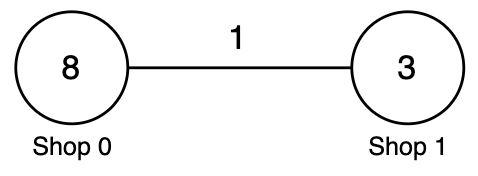
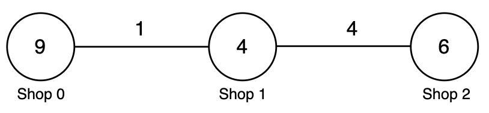
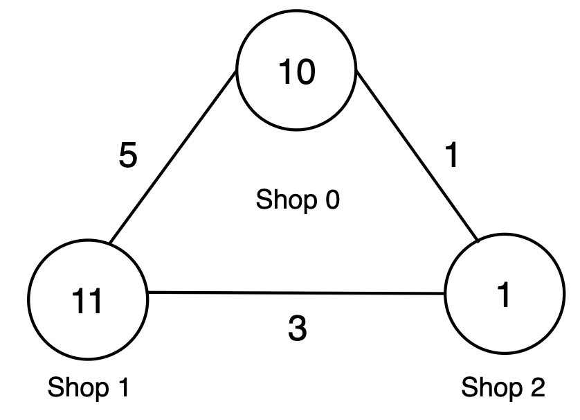

### 1. Description

You are given an integer `n` and an integer array `prices` of length `n`, where $\text{prices}[i]$ is the price of apples at shop `i`.

You are also given a 2D integer array `roads`, where $\text{roads}[i] = [u_{i}, v_{i}, \text{cost}_{i}, \text{tax}_{i}]$ represents a **bidirectional** road:

- $u_{i}$ and $v_{i}$ are the shops connected by the road.

- $\text{cost}_{i}$ is the cost to travel the road **without** carrying apples.

- $\text{tax}_{i}$ is the multiplier applied to $\text{cost}_{i}$ when traveling **with** apples.

For each shop `i`, you can either:

- Buy apples locally at shop `i` for $\text{prices}[i]$.

- Travel **empty** to any shop `j` using **any** number of roads, buy apples for $\text{prices}[j]$, and return to shop `i` while carrying apples, paying $cost * tax$ on each road used for the return trip.

The forward path, where you travel empty, and the return path may be **different**.

Return an integer array `ans` of length `n`, where $\text{ans}[i]$ is the **minimum** total cost to buy apples starting from shop `i`.

### 2. Function Contract

**Inputs**

- `n`: The number of shops, whose indices are `0` through $n - 1$.
- `prices`: An array of length `n`; $\text{prices}[i]$ is the local apple price at shop `i`.
- `roads`: The unique undirected roads. Each row `[u, v, cost, tax]` gives its endpoints, empty-travel cost, and loaded-cost multiplier.

Let $m = \texttt{roads.length}$. For an edge $e$, define its empty weight as $c_e$ and its loaded weight as $c_e t_e$. The traveler buys apples at exactly one shop. Choosing the starting shop itself requires no road travel.

**Return value**

Return an integer array `ans` of length `n`. For each start `i`, $\text{ans}[i]$ is the minimum of the local price and every valid empty journey to a purchase shop followed by a loaded journey back to `i`.

### 3. Examples

#### Example 1

- **Input:** n = 2, prices = [8,3], roads = [[0,1,1,2]]

- **Output:** [6,3]

- **Explanation:** 

<table border="1" bordercolor="#ccc" cellpadding="5" cellspacing="0" style="border-collapse:collapse;">
	<thead>
		<tr>
			<th>Shop `i`</th>
			<th>$\text{prices}[i]$</th>
			<th>Shop `j`</th>
			<th>$\text{prices}[j]$</th>
			<th>$\text{cost}_{i}$</th>
			<th>$\text{tax}_{i}$</th>
			<th>Travel cost</th>
			<th>Return cost</th>
			<th>Total</th>
			<th>Minimum</th>
		</tr>
	</thead>
	<tbody>
		<tr>
			<td>0</td>
			<td>8</td>
			<td>1</td>
			<td>3</td>
			<td>1</td>
			<td>2</td>
			<td>1</td>
			<td>$1 * 2 = 2$</td>
			<td>$1 + 2 + 3 = 6$</td>
			<td>$min(8, 6) = 6$</td>
		</tr>
		<tr>
			<td>1</td>
			<td>3</td>
			<td>0</td>
			<td>8</td>
			<td>1</td>
			<td>2</td>
			<td>1</td>
			<td>$1 * 2 = 2$</td>
			<td>$1 + 2 + 8 = 11$</td>
			<td>$min(3, 11) = 3$</td>
		</tr>
	</tbody>
</table>

Thus, the answer is `[6, 3]`.

#### Example 2

- **Input:** n = 3, prices = [9,4,6], roads = [[0,1,1,3],[1,2,4,2]]

- **Output:** [8,4,6]

- **Explanation:** 

**​​​​​​​**

<table border="1" bordercolor="#ccc" cellpadding="5" cellspacing="0" style="border-collapse:collapse;">
	<thead>
		<tr>
			<th>Shop `i`</th>
			<th>$\text{prices}[i]$</th>
			<th>Shop `j`</th>
			<th>$\text{prices}[j]$</th>
			<th>$\text{cost}_{i}$</th>
			<th>$\text{tax}_{i}$</th>
			<th>Travel cost</th>
			<th>Return cost</th>
			<th>Total</th>
			<th>Minimum</th>
		</tr>
	</thead>
	<tbody>
		<tr>
			<td>0</td>
			<td>9</td>
			<td>1</td>
			<td>4</td>
			<td>1</td>
			<td>3</td>
			<td>1</td>
			<td>$1 * 3 = 3$</td>
			<td>$1 + 3 + 4 = 8$</td>
			<td>$min(9, 8) = 8$</td>
		</tr>
		<tr>
			<td>1</td>
			<td>4</td>
			<td>2</td>
			<td>6</td>
			<td>4</td>
			<td>2</td>
			<td>4</td>
			<td>$4 * 2 = 8$</td>
			<td>$4 + 8 + 6 = 18$</td>
			<td>$min(4, 18) = 4$</td>
		</tr>
		<tr>
			<td>2</td>
			<td>6</td>
			<td>1</td>
			<td>4</td>
			<td>4</td>
			<td>2</td>
			<td>4</td>
			<td>$4 * 2 = 8$</td>
			<td>$4 + 8 + 4 = 16$</td>
			<td>$min(6, 16) = 6$</td>
		</tr>
	</tbody>
</table>

Thus, the answer is `[8, 4, 6]`.

#### Example 3

- **Input:** n = 3, prices = [10,11,1], roads = [[0,2,1,3],[1,2,3,4],[0,1,5,2]]

- **Output:** [5,11,1]

- **Explanation:** 

**​​​​​​​​​​​​​​**

<table border="1" bordercolor="#ccc" cellpadding="5" cellspacing="0" style="border-collapse:collapse;">
	<thead>
		<tr>
			<th>Shop `i`</th>
			<th>$\text{prices}[i]$</th>
			<th>Shop `j`</th>
			<th>$\text{prices}[j]$</th>
			<th>$\text{cost}_{i}$</th>
			<th>$\text{tax}_{i}$</th>
			<th>Travel cost</th>
			<th>Return cost</th>
			<th>Total</th>
			<th>Minimum</th>
		</tr>
	</thead>
	<tbody>
		<tr>
			<td>0</td>
			<td>10</td>
			<td>2</td>
			<td>1</td>
			<td>1</td>
			<td>3</td>
			<td>1</td>
			<td>$1 * 3 = 3$</td>
			<td>$1 + 3 + 1 = 5$</td>
			<td>$min(10, 5) = 5$</td>
		</tr>
		<tr>
			<td>1</td>
			<td>11</td>
			<td>2</td>
			<td>1</td>
			<td>3</td>
			<td>4</td>
			<td>3</td>
			<td>$3 * 4 = 12$</td>
			<td>$3 + 12 + 1 = 16$</td>
			<td>$min(11, 16) = 11$</td>
		</tr>
		<tr>
			<td>2</td>
			<td>1</td>
			<td>0</td>
			<td>10</td>
			<td>1</td>
			<td>3</td>
			<td>1</td>
			<td>$1 * 3 = 3$</td>
			<td>$1 + 3 + 10 = 14$</td>
			<td>$min(1, 14) = 1$</td>
		</tr>
	</tbody>
</table>

Thus, the answer is `[5, 11, 1]`.

### 4. Constraints

- $1 \le n \le 1000$

- $\text{prices.length} = n$

- $1 \le \text{prices}[i] \le 10^{9}$

- $0 \le \text{roads.length} \le min(n × (n - 1) / 2, 2000)$

- $\text{roads}[i] = [u_{i}, v_{i}, \text{cost}_{i}, \text{tax}_{i}]$

- $0 \le u_{i}, v_{i} \le n - 1$

- $u_{i} \neq v_{i}$

- $1 \le \text{cost}_{i} \le 10^{9}$

- $​​​​​​​1 \le tax_​​​​​​​i \le 100$​​​​​​​

- There are no **repeated** edges.
