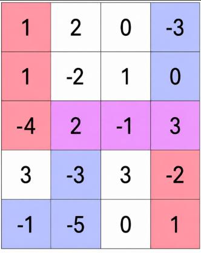
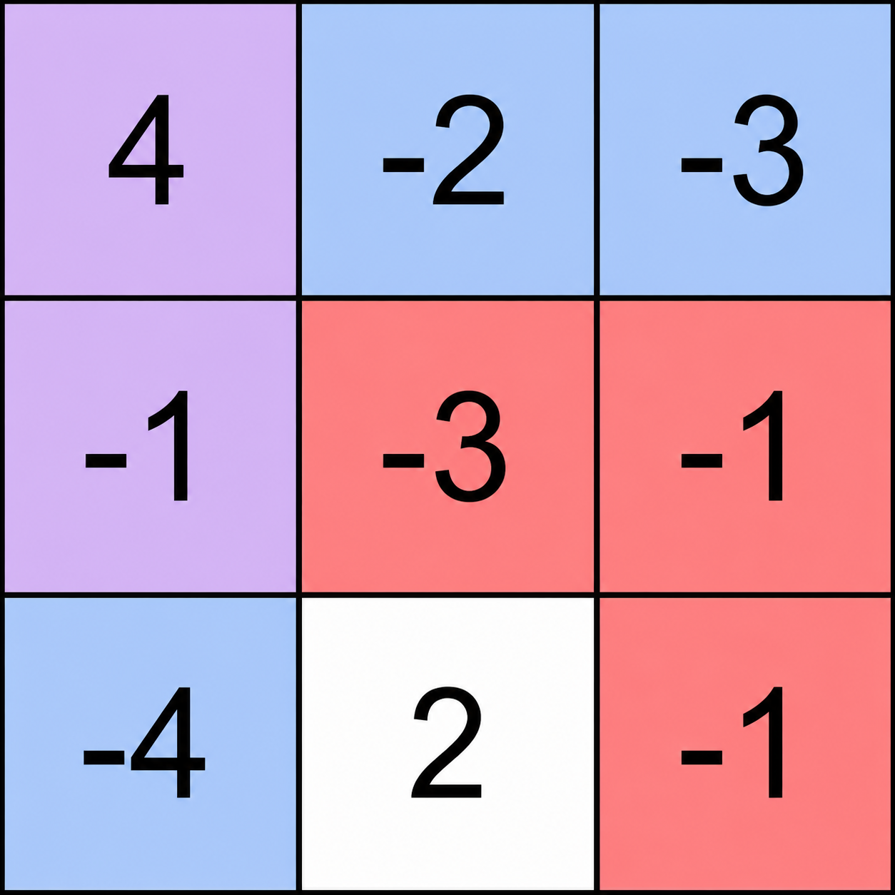

### 1. Description

You are given an `m x n` integer matrix `grid`.

Two players move across the grid:

- Player 1 starts at the top-left cell `(0, 0)` and can move only right or down. Their destination is the bottom-right cell $(m - 1, n - 1)$.

- Player 2 starts at the bottom-left cell $(m - 1, 0)$ and can move only right or up. Their destination is the top-right cell $(0, n - 1)$.

Each player must choose a valid path from their respective starting cell to their destination.

A cell is called **shared** if it belongs to **both** chosen paths.

Return an integer denoting the **maximum** possible sum of values of all **shared** cells.

### 2. Function Contract

**Inputs**

- `grid`: A rectangular integer matrix with at least two rows and at least two columns.

Let $M=\lvert\texttt{grid}\rvert$ and $N=\lvert\texttt{\text{grid}[0]}\rvert$. Path one connects $(0,0)$ to $(M-1,N-1)$ using only right and down moves. Path two connects $(M-1,0)$ to $(0,N-1)$ using only right and up moves.

For a chosen pair of paths, each matrix coordinate visited by both paths contributes its value exactly once to the intersection score.

**Return value**

Return the greatest intersection score attainable by any valid pair of paths.

### 3. Examples

#### Example 1

- **Input:** grid = [[1,2,0,-3],[1,-2,1,0],[-4,2,-1,3],[3,-3,3,-2],[-1,-5,0,1]]

- **Output:** 4

- **Explanation:** The diagram shows one optimal choice of paths.

- Player 1 follows the red/purple path from the top-left cell to the bottom-right cell:

		- `(0, 0) → (1, 0) → (2, 0) → (2, 1) → (2, 2) → (2, 3) → (3, 3) → (4, 3)`

- Player 2 follows the blue/purple path from the bottom-left cell to the top-right cell:

		- `(4, 0) → (4, 1) → (3, 1) → (2, 1) → (2, 2) → (2, 3) → (1, 3) → (0, 3)`

- The shared cells are `(2, 1)`, `(2, 2)`, and `(2, 3)`.

- The sum is $2 + (-1) + 3 = 4$, which is the maximum possible sum.

#### Example 2

- **Input:** grid = [[4,-2,-3],[-1,-3,-1],[-4,2,-1]]

- **Output:** 3

- **Explanation:** One optimal pair of paths is shown in the diagram.

- Player 1 follows the red/purple path:

		- `(0, 0) → (1, 0) → (1, 1) → (1, 2) → (2, 2)`

- Player 2 follows the blue/purple path:

		- `(2, 0) → (1, 0) → (0, 0) → (0, 1) → (0, 2)`

- The shared cells are `(0, 0)` and `(1, 0)`.

- The sum is $4 + (-1) = 3$, which is the maximum possible.

### 4. Constraints

- $m = \text{grid.length}$

- $n = \text{grid}[i].length$

- $2 \le m, n \le 1000$

- $4 \le m * n \le 5 * 10^{5}$

- $-100 \le \text{grid}[i][j] \le 100$
