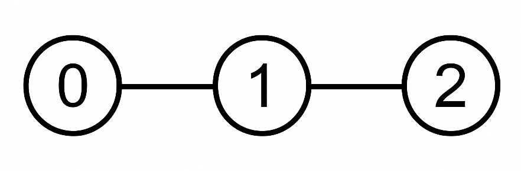
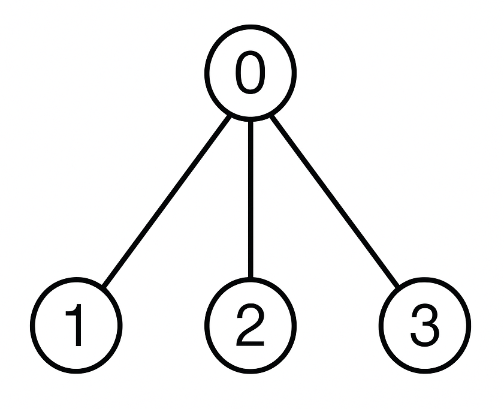

### 1. Description

You are given a rooted tree with `n` nodes labeled from 0 to $n - 1$, represented by an integer array `parent` of length `n`, where:

- $\text{parent}[0] = -1$ (node 0 is the root).

- For each $1 \le i < n$, $\text{parent}[i]$ is the parent of node `i` ($0 \le \text{parent}[i] < i$).

You are also given an integer array nums of length `n`, where $\text{nums}[i]$ is the value of node `i`, and an integer `k`.

A non-empty subset of nodes is called **valid** if:

- The **sum** of the values of the selected nodes is **divisible** by `k`.

- No **two** selected nodes are **adjacent** in the tree (no node and its direct parent are both included in the subset).

Return the number of valid subsets modulo $10^{9} + 7$.

### 2. Function Contract

**Inputs**

- `parent`: The rooted-tree encoding. $\text{parent}[0]$ is `-1`; for every later node `i`, $\text{parent}[i]$ is its unique direct parent and has a smaller index.
- `nums`: The node values, where $\text{nums}[i]$ belongs to node `i`.
- `k`: The positive divisor used to test a selected subset's value sum.

Let $N=\lvert\texttt{parent}\rvert=\lvert\texttt{nums}\rvert$ and $K=k$. Two nodes are adjacent exactly when one is the direct parent of the other. A counted subset must be nonempty, contain no adjacent pair, and have total value congruent to zero modulo $K$.

**Return value**

Return the number of valid node subsets modulo $1{,}000{,}000{,}007$.

### 3. Examples

#### Example 1

**Input:** parent = [-1,0,1], nums = [1,2,3], k = 3

**Output:** 1

**Explanation:**

**

​​​​​​​**

The only valid subset is `{2}`. It contains node 2 with value 3, which is divisible by 3.

#### Example 2

**Input:** parent = [-1,0,0,0], nums = [2,1,2,1], k = 3

**Output:** 2

**Explanation:**

**

​​​​​​​**​​​​​​​

The valid subsets are:

- `{1, 2}`: Nodes 1 and 2 are both children of node 0 and not directly connected to each other. Their values sum to $1 + 2 = 3$, which is divisible by 3.

- `{2, 3}`: Nodes 2 and 3 are also non-adjacent. Their values sum to $2 + 1 = 3$, which is divisible by 3.

No other subset satisfies both conditions. Therefore, the answer is 2.

### 4. Constraints

- $n = \text{parent.length} = \text{nums.length}$

- $1 \le n \le 1000$

- $\text{parent}[0] = -1$

- For all $1 \le i < n$:

		<li data-end="147" data-start="103">$0 \le \text{parent}[i] < i$

	</li>
- $1 \le \text{nums}[i] \le 10^{9}$

- $1 \le k \le 100$​​​​​​​​​​​​​​`​​​​​​​`

- `parent` describes a valid rooted tree.