## Examples

**Example 1**

- Input: `parent = [-1,0,1], nums = [1,2,3], k = 3`
- Output: `1`
- Explanation: The only valid subset is `{2}`. Node `2` has value `3`, which is divisible by `3`. The diagram labels each node as `node: value`; the selected node is highlighted.

```mermaid
---
config:
  theme: base
  htmlLabels: false
  themeVariables:
    background: "#ffffff"
    textColor: "#0f172a"
  flowchart:
    padding: 3
    nodeSpacing: 28
    rankSpacing: 42
---
flowchart TB
    accTitle: Example 1 rooted chain and its valid selected node
    accDescr: Node 0 with value 1 is the root, node 1 with value 2 is its child, and highlighted node 2 with value 3 is the child of node 1. Only node 2 is selected.

    n0["0: 1"] --- n1["1: 2"] --- n2["2: 3"]

    classDef node fill:#f8fafc,stroke:#64748b,color:#0f172a,stroke-width:2px,font-size:13px
    classDef selected fill:#dcfce7,stroke:#15803d,color:#0f172a,stroke-width:3px,font-size:13px
    class n0,n1 node
    class n2 selected
```

**Example 2**

- Input: `parent = [-1,0,0,0], nums = [2,1,2,1], k = 3`
- Output: `2`
- Explanation: The valid subsets are `{1, 2}` and `{2, 3}`. Nodes `1`, `2`, and `3` are siblings, so choosing node `2` together with either node `1` or node `3` never selects an adjacent pair. Their sums are respectively $1+2=3$ and $2+1=3$, both divisible by `3`. No other subset satisfies both requirements, so the result is `2`.

In the diagram, the green node belongs to both valid subsets, while either blue sibling completes one of them. The root is not selected.

```mermaid
---
config:
  theme: base
  htmlLabels: false
  themeVariables:
    background: "#ffffff"
    textColor: "#0f172a"
  flowchart:
    padding: 3
    nodeSpacing: 34
    rankSpacing: 42
---
flowchart TB
    accTitle: Example 2 rooted star and its two valid sibling pairs
    accDescr: Root node 0 has value 2 and three children. Node 2 with value 2 belongs to both valid subsets. Either node 1 or node 3, each with value 1, can be selected with node 2.

    n0["0: 2"] --- n1["1: 1"]
    n0 --- n2["2: 2"]
    n0 --- n3["3: 1"]

    classDef root fill:#f8fafc,stroke:#64748b,color:#0f172a,stroke-width:2px,font-size:13px
    classDef option fill:#dbeafe,stroke:#1d4ed8,color:#0f172a,stroke-width:2px,font-size:13px
    classDef shared fill:#dcfce7,stroke:#15803d,color:#0f172a,stroke-width:3px,font-size:13px
    class n0 root
    class n1,n3 option
    class n2 shared
```

