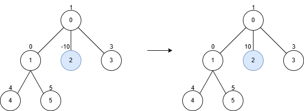
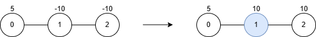
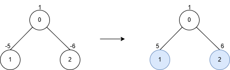
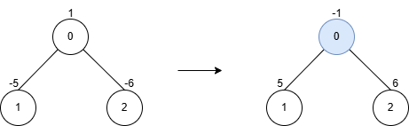

### 1. Description

You are given an undirected tree rooted at node 0, with `n` nodes numbered from 0 to $n - 1$. The tree is represented by a 2D integer array `edges` of length $n - 1$, where $\text{edges}[i] = [u_{i}, v_{i}]$ indicates an edge between nodes $u_{i}$ and $v_{i}$.

You are also given an integer array `nums` of length `n`, where $\text{nums}[i]$ represents the value at node `i`, and an integer `k`.

You may perform **inversion operations** on a subset of nodes subject to the following rules:

- **Subtree Inversion Operation:**

		<li data-end="887" data-start="802">
		When you invert a node, every value in the subtree rooted at that node is multiplied by -1.

	</li>
- **Distance Constraint on Inversions:**

		<li data-end="1020" data-start="934">
		You may only invert a node if it is “sufficiently far” from any other inverted node.

- If you invert two nodes `a` and `b`, the **distance** (the number of edges on the unique path between them) must be **at least** `k`.

	</li>

Return the **maximum** possible **sum** of the tree’s node values after applying **inversion operations**.

### 2. Function Contract

**Inputs**

- `edges`: The $n-1$ undirected edges of a tree rooted at node `0`.
- `nums`: The length-$n$ array of initial node values.
- `k`: The minimum permitted edge distance between every pair of inverted nodes.

Let $n=\lvert\texttt{nums}\rvert$.

**Return value**

Return the maximum total of the final node values over every inversion-node subset whose distinct members are pairwise at distance at least `k`.

### 3. Examples

#### Example 1

**Input:** edges = [[0,1],[0,2],[0,3],[1,4],[1,5]], nums = [1,0,-10,3,4,5], k = 2

**Output:** 23

**Explanation:**

After inverting the subtree rooted at node 2, the maximum sum becomes $1 + 0 + 10 + 3 + 4 + 5 = 23$.

#### Example 2

**Input:** edges = [[0,1],[1,2]], nums = [5,-10,-10], k = 1

**Output:** 25

**Explanation:**

**

**

After inverting the subtree rooted at node 1, the maximum sum becomes $5 + 10 + 10 = 25$.

#### Example 3

**Input:** edges = [[0,1],[0,2]], nums = [1,-5,-6], k = 2

**Output:** 12

**Explanation:**

- After inverting the subtrees rooted at nodes 1 and 2, `nums = [1, 5, 6]`.

- This is valid because nodes 1 and 2 are two edges apart (`1 → 0` and `0 → 2`), which is at least `k`.

- The maximum sum is $1 + 5 + 6 = 12$.

#### Example 4

**Input:** edges = [[0,1],[0,2]], nums = [1,-5,-6], k = 3

**Output:** 10

**Explanation:**

- After inverting the subtree rooted at nodes 0, `nums = [-1, 5, 6]`.

- The maximum sum is $(-1) + 5 + 6 = 10$.

- Note that we cannot invert nodes 1 and 2 because their distance is $2 < k = 3$.

### 4. Constraints

- $\text{nums.length} = n$

- $\text{edges.length} = n - 1$

- $2 \le n \le 5 * 10^{4}$

- $\text{edges}[i].length = 2$

- $0 \le \text{edges}[i][0], \text{edges}[i][1] < n$

- $-4 * 10^{4} \le \text{nums}[i] \le 4 * 10^{4}$

- $1 \le k \le 50$

- It is guaranteed that `edges` forms a tree.