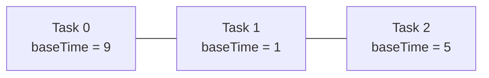
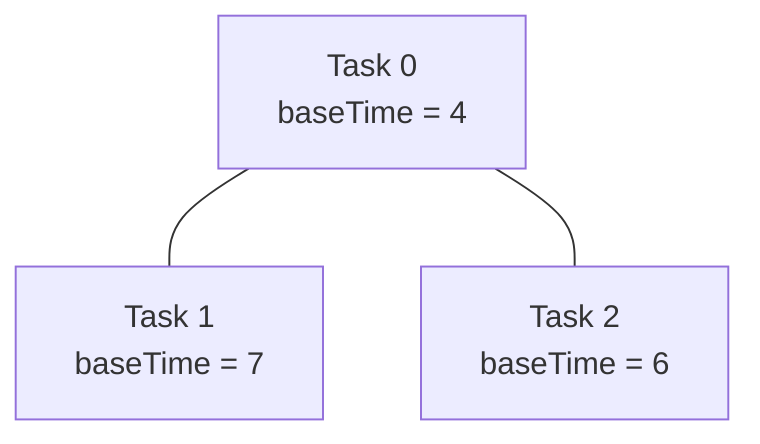
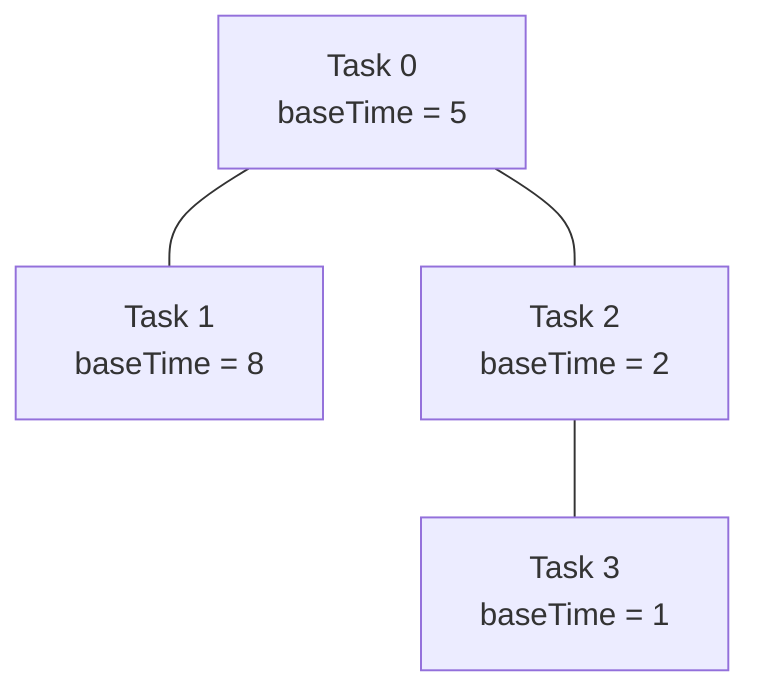

## Examples

**Example 1**

- Input: `n = 3, edges = [[0,1],[1,2]], baseTime = [9,1,5]`
- Output: `14`
- **Explanation:** The nodes and their base times form the following chain.

Choose task `1` as the root. Tasks `0` and `2` are leaves, so they finish at `9` and `5`. For task `1`, `earliest = 5`, `latest = 9`, and `ownDuration = (9 - 5) + 1 = 5`; its finish time is `9 + 5 = 14`. No other root gives a smaller result, so the answer is `14`.

**Example 2**

- Input: `n = 3, edges = [[0,1],[0,2]], baseTime = [4,7,6]`
- Output: `12`
- **Explanation:** The undirected tree has task `0` connected to the other two tasks.

Choose task `0` as the root. Leaf tasks `1` and `2` finish at `7` and `6`. Thus `earliest = 6`, `latest = 7`, and task `0` has `ownDuration = (7 - 6) + 4 = 5`. Its finish time is `7 + 5 = 12`, which is the minimum over all root choices.

**Example 3**

- Input: `n = 4, edges = [[0,1],[0,2],[2,3]], baseTime = [5,8,2,1]`
- Output: `16`
- **Explanation:** The tree and base times are shown below.

Choose task `1` as the root. Task `3` is a leaf and finishes at `1`. Task `2` has only that child, so `earliest = latest = 1`, its own duration is `2`, and it finishes at `3`. Task `0` likewise has only task `2` as a child in this orientation; it finishes at `3 + 5 = 8`. Finally, task `1` has only task `0` as a child and finishes at `8 + 8 = 16`. This is the minimum possible root finish time.
