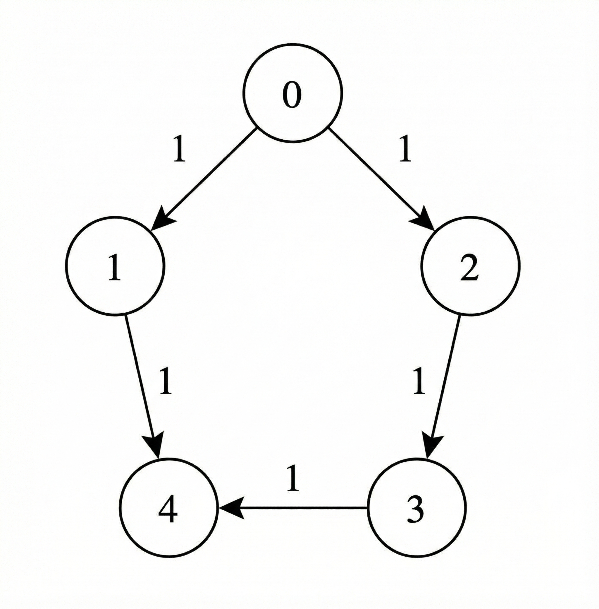
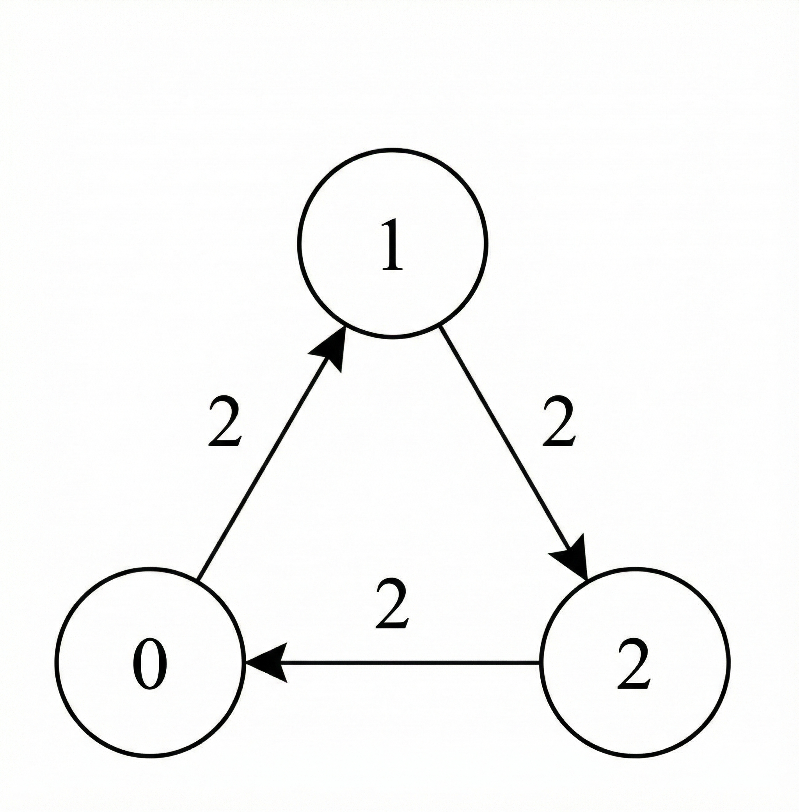
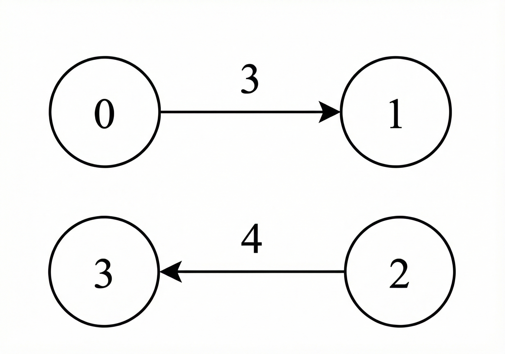

## Description

You are given a **directed** weighted graph with `n` nodes labeled from 0 to $n - 1$.

The graph is represented by a 2D integer array `edges`, where $\text{edges}[i] = [u_{i}, v_{i}, t_{i}]$ indicates a directed edge from node $u_{i}$ to node $v_{i}$ that takes $t_{i}$ seconds to traverse.

You are also given an integer `power` representing the initial available power, and an integer array `cost` of length `n`, where $\text{cost}[u]$ represents the power required to forward the signal from node `u` through **any** one of its outgoing edges.

You are given two integers `source` and `target`.

The signal starts at `source` at time 0 with `power` units of power and follows these rules:

- The signal may traverse a directed edge from node `u` only if the remaining power is **at least** $\text{cost}[u]$.

- No power is consumed when the signal arrives at a node, unless it later leaves that node by traversing another edge.

- When the signal is forwarded from node `u`, the remaining power is **decreased** by $\text{cost}[u]$ units.

- Traversing an edge $\text{edges}[i] = [u_{i}, v_{i}, t_{i}]$ **increases** the total time by $t_{i}$ seconds.

Return an integer array `answer` of size 2, where:

- $\text{answer}[0]$ is the **minimum** time required for the signal to reach node `target`.

- $\text{answer}[1]$ is the **maximum** remaining power among all paths that achieve $\text{answer}[0]$.

If the signal cannot reach `target`, return `[-1, -1]`.
### Function Contract

$solve(n, edges, power, cost, source, target) -> \text{list}[int]$

Let $m = \lvert\texttt{edges}\rvert$ and $P = \texttt{power}$.

**Inputs**

- `n`: The number of graph nodes, labeled from `0` through $n - 1$.
- `edges`: Directed weighted edges. Each entry `[u, v, travel_time]` permits travel only from `u` to `v` and contributes $\text{travel}_{time}$ seconds.
- `power`: The signal's initial power $P$.
- `cost`: A length-`n` array in which $\text{cost}[u]$ is the power consumed whenever the signal leaves node `u` through any outgoing edge.
- `source`: The node at which the signal starts at time zero with all $P$ power units.
- `target`: The destination node.

**Output**

Return `[minimum_time, maximum_remaining_power]`. The first component is the least travel time over all legal paths from `source` to `target`; the second is the greatest remaining power among only the paths attaining that least time. If no legal path reaches `target`, return `[-1, -1]`.

A departure from `u` is legal exactly when the current power is at least $\text{cost}[u]$; that cost is subtracted once for the departure, independently of which outgoing edge is selected. Arrival does not consume power. In particular, when $source = target$, the result is `[0, power]` without paying any departure cost.

### Examples

#### Example 1

**Input:** n = 5, edges = [[0,1,1],[1,4,1],[0,2,1],[2,3,1],[3,4,1]], power = 4, cost = [2,3,1,1,1], source = 0, target = 4

**Output:** [3,0]

**Explanation:**

- The signal starts at node 0 with 4 units of power.

- The path `0 -> 1 -> 4` is not valid, because after leaving node 0, the signal has 2 units of power remaining, which is less than $\text{cost}[1] = 3$.

- The valid path `0 -> 2 -> 3 -> 4` takes a total time of 3.

- The total power consumed along this path is $\text{cost}[0] + \text{cost}[2] + \text{cost}[3] = 4$, leaving 0 remaining power.

- Hence, the answer is `[3, 0]`.

#### Example 2

**Input:** n = 3, edges = [[0,1,2],[1,2,2],[2,0,2]], power = 3, cost = [1,1,1], source = 1, target = 1

**Output:** [0,3]

**Explanation:**

- Since the `source` and `target` are the same node, no traversal is required.

- Hence, the minimum total time taken is 0, and no power is consumed.

- Therefore, the answer is `[0, 3]`.

#### Example 3

​​​​​​​

**Input:** n = 4, edges = [[0,1,3],[2,3,4]], power = 3, cost = [1,1,1,1], source = 0, target = 3

**Output:** [-1,-1]

**Explanation:**

There is no valid path from `source` to `target`, therefore return `[-1, -1]`.

### Constraints

- $1 \le n \le 1000$

- $0 \le \text{edges.length} \le 1000$

- $\text{edges}[i] = [u_{i}, v_{i}, t_{i}]$

- $0 \le u_{i}, v_{i} \le n - 1$

- $1 \le t_{i} \le 10^{9}$

- $1 \le power \le 1000$

- $\text{cost.length} = n$

- $1 \le \text{cost}[i] \le 2000$

- $0 \le source, target \le n - 1$