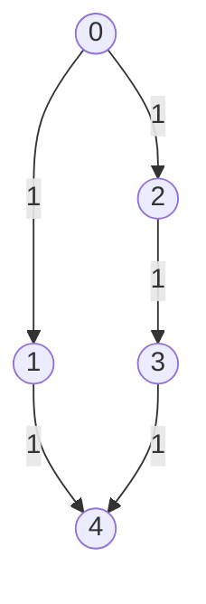
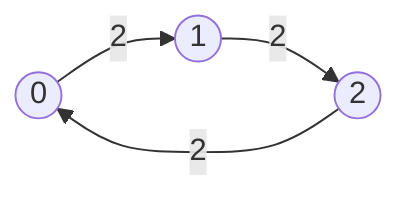
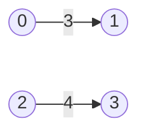

## Examples

**Example 1**

- Input: `n = 5, edges = [[0,1,1],[1,4,1],[0,2,1],[2,3,1],[3,4,1]], power = 4, cost = [2,3,1,1,1], source = 0, target = 4`
- Output: `[3,0]`

- **Explanation:** The signal starts at node `0` with `4` power. Route `0 -> 1 -> 4` is invalid: leaving `0` spends `cost[0] = 2`, after which the remaining `2` is smaller than `cost[1] = 3`, so node `1` cannot forward the signal. Route `0 -> 2 -> 3 -> 4` is legal and takes `1 + 1 + 1 = 3` seconds. Its departures consume `cost[0] + cost[2] + cost[3] = 2 + 1 + 1 = 4`, leaving no power, so the result is `[3,0]`.

**Example 2**

- Input: `n = 3, edges = [[0,1,2],[1,2,2],[2,0,2]], power = 3, cost = [1,1,1], source = 1, target = 1`
- Output: `[0,3]`

- **Explanation:** Both `source` and `target` are node `1`. No edge traversal is required, so the minimum time is `0`; because the signal never leaves a node, none of its initial `3` power is consumed. The answer is therefore `[0,3]`.

**Example 3**

- Input: `n = 4, edges = [[0,1,3],[2,3,4]], power = 3, cost = [1,1,1,1], source = 0, target = 3`
- Output: `[-1,-1]`

- **Explanation:** Node `0` can reach only node `1`; the edge into target node `3` begins in the separate component at node `2`. There is no directed path from `source` to `target`, so the required unreachable result is `[-1,-1]`.
