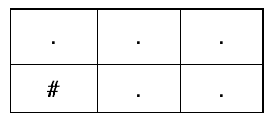
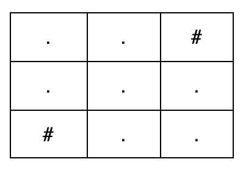

### 1. Description

You are given three integers `m`, `n`, and `k`.

Construct **any** `m x n` grid consisting only of the characters `'.'` and `'#'`, where:

- `'.'` represents a free cell.

- `'#'` represents an obstacle cell.

A **valid path** is a sequence of free cells that:

- Starts at the top-left cell `(0, 0)`.

- Ends at the bottom-right cell $(m - 1, n - 1)$.

- Moves only:

		- Right, from `(i, j)` to $(i, j + 1)$, or

- Down, from `(i, j)` to $(i + 1, j)$.

Return any grid such that there are **exactly** `k` **valid paths** from the top-left cell to the bottom-right cell. If no such grid exists, return an empty array.

### 2. Function Contract

$solve(m, n, k) -> \text{list}[str]$

**Inputs**

- `m`: The positive number of grid rows.
- `n`: The positive number of grid columns.
- `k`: The required positive number of valid paths.

Rows and columns use zero-based indices. A valid path begins at `(0, 0)`, ends at $(m - 1, n - 1)$, stays on `.` cells, and moves only right or down.

**Output**

Return a list of exactly `m` strings of length `n`, using only `.` for free cells and `#` for obstacles, such that the grid contains exactly `k` valid paths. More than one construction may be correct. Return `[]` precisely when no valid construction exists.

### 3. Examples

#### Example 1

- **Input:** m = 2, n = 3, k = 2

- **Output:** ["...","#.."]

- **Explanation:** 

There are exactly $k = 2$ valid paths from `(0, 0)` to `(1, 2)`:

- `(0, 0) → (0, 1) → (0, 2) → (1, 2)`

- `(0, 0) → (0, 1) → (1, 1) → (1, 2)`

#### Example 2

- **Input:** m = 3, n = 3, k = 4

- **Output:** ["..#","...","#.."]

- **Explanation:** 

There are exactly $k = 4$ valid paths from `(0, 0)` to `(2, 2)`:

- `(0, 0) → (0, 1) → (1, 1) → (1, 2) → (2, 2)`

- `(0, 0) → (0, 1) → (1, 1) → (2, 1) → (2, 2)`

- `(0, 0) → (1, 0) → (1, 1) → (1, 2) → (2, 2)`

- `(0, 0) → (1, 0) → (1, 1) → (2, 1) → (2, 2)`

#### Example 3

- **Input:** m = 1, n = 4, k = 2

- **Output:** []

- **Explanation:** ​

No grid exists with exactly $k = 2$ valid paths for a `1 x 4` grid, so the answer is an empty array.

### 4. Constraints

- $1 \le m, n \le 10$

- $1 \le k \le 4$
