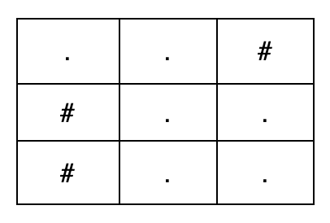
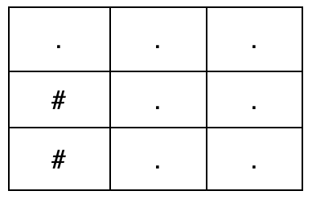

### 1. Description

You are given an integer `k`.

Construct **any** grid consisting only of the characters `'.'` and `'#'`, where:

- `'.'` represents a free cell.

- `'#'` represents an obstacle cell.

The grid must contain **at most** 25 rows and **at most** 25 columns.

A **valid path** is a sequence of free cells that:

- Starts at the top-left cell `(0, 0)`.

- Ends at the bottom-right cell $(m - 1, n - 1)$, where `m` and `n` are the dimensions of your constructed grid.

- Moves only:

		<li>Right, from `(i, j)` to $(i, j + 1)$, or

- Down, from `(i, j)` to $(i + 1, j)$.

	</li>

Return any grid such that there are **exactly `k` valid paths** from the top-left cell to the bottom-right cell. If no such grid exists, return an empty array.

### 2. Function Contract

$solve(k) -> \text{list}[str]$

**Inputs**

- `k`: The required positive number of valid right/down paths.

Rows and columns use zero-based indices. The dimensions $m$ and $n$ are selected by the returned construction rather than supplied as inputs.

**Output**

Return a non-empty list of at most 25 strings, each having the same positive length of at most 25. Every character must be `.` or `#`, both corner cells must be usable by the required paths, and the grid must contain exactly `k` paths from `(0, 0)` to $(m - 1, n - 1)$ using only right and down moves. Different valid constructions are equivalent answers. Return `[]` only when no permitted grid exists.

### 3. Examples

#### Example 1

**Input:** k = 2

**Output:** ["..#","#..","#.."]

**Explanation:**

The grid contains exactly 2 valid paths from `(0, 0)` to `(2, 2)`:

- `(0, 0) → (0, 1) → (1, 1) → (1, 2) → (2, 2)`

- `(0, 0) → (0, 1) → (1, 1) → (2, 1) → (2, 2)`

#### Example 2

**Input:** k = 3

**Output:** ["...","#..","#.."]

**Explanation:**

**​​​​​​​**

The grid contains exactly 3 valid paths from `(0, 0)` to `(2, 2)`:

- `(0, 0) → (0, 1) → (0, 2) → (1, 2) → (2, 2)`

- `(0, 0) → (0, 1) → (1, 1) → (1, 2) → (2, 2)`

- `(0, 0) → (0, 1) → (1, 1) → (2, 1) → (2, 2)`

### 4. Constraints

​​​​​​​

- $1 \le k \le 1000$