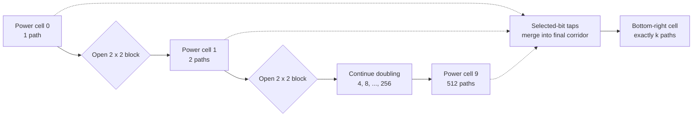

## General

The bound `k <= 1000` means ten binary digits are sufficient. Build a fixed $20 \times 13$ grid containing a diagonal ladder of ten power cells and a vertical corridor in column 12. Initially every cell is blocked.

**Make one cell carry each power of two**

Let the power cell for bit $i$ be $P_i=(2i,i)$. Cell $P_0=(0,0)$ receives one path. For every $i<9$, open the $2 \times 2$ block whose top-left corner is $P_i$, then open the cell immediately below that block's bottom-right corner. If $P_i$ receives $2^i$ paths, the block offers exactly two routes to its bottom-right corner, so that corner receives $2^{i+1}$ paths. The single downward connector carries the same count to $P_{i+1}$. Induction therefore gives exactly $2^i$ paths at every $P_i$.

**Select powers and add them without creating cross-paths**

The top-right cell of the block at bit $i$ is on row `2 * i` and receives the same $2^i$ paths as $P_i$. When bit $i$ of `k` is set, open that row from this cell through column 12. This creates one horizontal tap from the power ladder to the final corridor.

Consecutive tap rows are separated by an odd-numbered row. On those separating rows, the ladder stays near the diagonal and column 12 is the only distant free cell, so paths cannot move vertically between horizontal taps before reaching the corridor. Once a path reaches column 12 it can move only down; right/down motion cannot return it to a lower tap. Thus every selected $2^i$ contribution has exactly one suffix to the bottom-right cell and the contributions merge only by addition. The final count is

$$
\sum_{i=0}^{9} [\text{bit } i \text{ of } k \text{ is set}]\,2^i = k.
$$

Every legal `k` has such a ten-bit decomposition, so an empty result is never needed for the source domain.

## Complexity detail

The accepted implementation always initializes and serializes a $20 \times 13$ grid, visits ten bit positions, and opens at most thirteen cells for each selected tap. Under the source constraint `k <= 1000`, both its running time and returned storage are therefore $O(1)$, with exact bounds of 260 output cells and a constant number of edits.

If the construction were generalized to an unrestricted $B$-bit value, the ladder would use $O(B)$ rows and columns and the returned grid would occupy $O(B^2)$ cells. The legal source domain fixes $B \le 10$, so runtime scaling cannot honestly distinguish asymptotic classes; the complete 1,000-input domain is checked instead.

## Alternatives and edge cases

- **Pascal-triangle grid:** An open rectangle exposes binomial path counts, and obstacles can select some of them, but controlling arbitrary totals without accidental routes is less direct than the isolated power ladder.
- **Search over obstacle masks:** Exhaustive or heuristic search can discover small examples, but the $25 \times 25$ allowance has far too many layouts and offers no simple completeness proof.
- **Variable-size ladder:** Using only `k.bit_length()` power cells can shrink many outputs, but fixed maximum dimensions make the accepted construction simpler without changing the bounded complexity.
- **`k = 1`:** Only the bit-zero tap reaches the final corridor; every unselected ladder branch is a dead end and cannot add a path.
- **`k = 1000`:** Bits 3, 5, 6, 7, 8, and 9 are selected, and their contributions sum to exactly 1000 while staying within ten power cells.
- **Blocked separator rows:** Opening any distant cell between adjacent tap rows can let a path switch rows early and create unintended combinations.
- **Final-corridor direction:** Paths already in column 12 cannot move left, which is essential; allowing leftward motion would connect later taps and invalidate the sum argument.
- **Non-unique output:** Correctness must be judged by dimensions, alphabet, and path count, not by comparison with one serialized grid.
