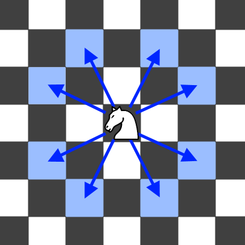

## Description

You are given two integer arrays `start` and `target`, where each array is of the form `[x, y]` representing a cell on a standard 8 x 8 chessboard.

Return `true` if a knight can move from `start` to `target` in an **even** number of moves. Otherwise, return `false`.

**Note:** A valid knight move consists of moving two squares in one direction and one square perpendicular to it. The figure below illustrates all eight possible moves from a cell.

### Function Contract

**Inputs**

- `start`: Two zero-based coordinates `[x, y]` for the starting cell.
- `target`: Two zero-based coordinates `[x, y]` for the destination cell.

Both coordinates of both cells are between `0` and `7`, inclusive.

**Return value**

Return `true` when at least one legal knight route from `start` to `target` contains an even number of moves, including the zero-move route when the cells are equal. Return `false` otherwise.

### Examples
#### Example 1

**Input:** start = [1,1], target = [2,2]

**Output:** true

**Explanation:**

One possible sequence of moves is `(1, 1) -> (3, 2) -> (2, 4) -> (4, 3) -> (2, 2)`.

The knight reaches the target in 4 moves, which is even. Thus, the answer is `true`.

#### Example 2

**Input:** start = [4,5], target = [6,6]

**Output:** false

**Explanation:**​​​​​​​

It is impossible to reach $target = [6, 6]$ from $start = [4, 5]$ in an even number of moves. Thus, the answer is `false`.

### Constraints

- $\text{start.length} = \text{target.length} = 2$

- $0 \le \text{start}[i], \text{target}[i] \le 7$